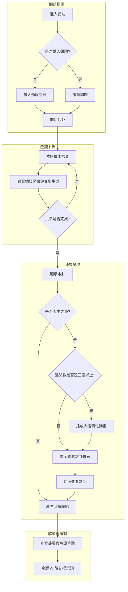

# 易經金錢卦 (I-Ching Coin Toss)

一個以純前端技術打造的易經金錢卦沉浸式線上占卜網頁。透過逼真的 3D 銅錢翻轉動畫、頌缽音效與傳統易經卦象演算法，為使用者帶來充滿儀式感的數位占卜體驗，並能自動產生精準的 Prompt 讓 AI 進行深度解卦。

👉 **[線上體驗連結 (Live Demo)](https://chu-mi-labs.github.io/i-ching/)**

---

## 🌟 專案特色 (Features)

*   **沉浸式儀式感**：精緻的背景設計、頌缽與銅錢清脆的音效，搭配 3D 銅錢翻轉動畫。
*   **自訂擲筊模式**：提供手動擲筊（完整體驗）、自動擲筊（省力連擲）與直接觀卦（跳過動畫）三種模式，滿足不同使用情境。
*   **跨平台支援**：純靜態網頁設計，無論在 Windows/macOS 電腦端，或是 iOS/Android 手機端皆能完美呈現。
*   **動態卦象演化**：支援「本卦」與「之卦」的 3D 牌卡翻轉展演，變爻達 3 個以上更會觸發「太極裂開」特效。
*   **一鍵 AI 解卦**：依據朱熹《易贊》規則，精準判定 0-6 個變爻的解卦重點，並自動產生 Prompt 讓使用者一鍵複製，貼給 ChatGPT 或 Claude 進行解卦。
*   **100% 隱私安全**：無後端伺服器，所有運算皆在使用者瀏覽器本地執行，保證占卜隱私。

## 🛠️ 技術堆疊 (Tech Stack)

*   **HTML5 / CSS3**: 採用純原生的 CSS 3D 變形 (Transforms) 與轉場動畫 (Transitions)，無依賴任何外部前端框架。
*   **Vanilla JavaScript (ES6)**: 模組化管理占卜演算法 (`iching_core.js`) 與六十四卦資料集 (`iching_data.js`)。
*   **GitHub Pages**: 自動化部署與靜態網站代管。

## 📁 檔案架構 (File Structure)

```text
i-ching/
├── index.html        # 主網頁架構、UI 樣式與 DOM 互動邏輯
├── iching_core.js    # 核心演算法 (擲筊邏輯、變爻判定、狀態推演)
├── iching_data.js    # 易經六十四卦與三百八十四爻的資料集與 Prompt 生成輔助
└── README.md         # 專案說明文件
```

---

## 📖 系統工作流程與測試規格 (Workflow & Spec)

本區段記錄專案的預期使用者流程 (User Flow)、邊界情況 (Edge Cases) 與測試目標 (Testing Targets)。任何新功能開發或 UI 修改，都必須確保不破壞此處列出的行為。

### 0. 跨平台與裝置相容性 (Cross-Platform Compatibility)
本應用程式為純靜態網頁，必須確保在以下環境皆能正常顯示與流暢互動：
*   **桌上型電腦 (Desktop)**: Windows (Chrome, Edge) / macOS (Safari, Chrome)
*   **行動裝置 (Mobile)**: iOS (Safari, Chrome) / Android (Chrome)
*   所有 3D 翻面動畫、音效播放、剪貼簿複製等核心功能，皆需在上述平台實測通過，特別注意行動裝置瀏覽器的原生限制（如雙擊放大、3D 渲染鏡像 Bug 等）。

### 1. 核心使用者流程 (Core User Flow)



1. **進入網站與初始狀態**：
   - 載入頁面後，應看見「易經金錢卦」標題與「問卦三守則」。
   - 輸入框允許使用者輸入欲占卜的問題。
   - 可在「擲筊模式」下拉選單中，選擇「手動擲筊」、「自動擲筊」或「直接觀卦」。
   - 點擊「開始起卦」按鈕即可進入後續流程。

2. **擲筊與動畫演繹 (Toss Animation)**：
   - 畫面切換至擲筊區，並顯示「請點擊按鈕，擲出第一爻」。
   - 使用者點擊按鈕後，按鈕會鎖定 (Disabled) 防止連點。
   - 三枚銅錢進行 3D 翻轉動畫（正反面機率各 50%）。
   - 音效依序播放：起卦頌缽聲 -> 銅錢掉落聲 -> 畫爻「叮」聲。
   - 銅錢停止後，根據點數加總（6, 7, 8, 9）由下往上繪製本卦的一爻。
   - 按鈕恢復可用，提示「請繼續擲第 X 爻」。重複六次完成本卦。

3. **卦象展演 (Result Presentation)**：
   - **3D 牌卡翻轉 UI**：本卦在畫面正中央以 100% 寬度展開。
   - **變爻判定與動畫 (Tai Chi Animation)**：若六爻中包含「老陰(6)」或「老陽(9)」，則產生「之卦」。
     - **當變爻數量達 3 個（含）以上**：會自動觸發「太極裂開、強光乍現」的轉化動畫 (Tai Chi Animation)，接著才顯示之卦的翻面按鈕，營造天地變動的強烈視覺效果。
   - 若產生之卦，牌卡下方會顯示一個半透明的箭頭按鈕「查看之卦 →」。
   - 點擊按鈕後，牌卡以紙面翻轉效果切換並顯示演化後的「之卦」，按鈕自動變為「← 返回本卦」。

4. **結果解讀與複製 (Result & Copy)**：
   - 卦象下方會滑順展開「卦象總結」與「給 AI 的解卦提示詞 (Prompt)」。
   - **不同變爻數量的解卦邏輯 (Prompt Generation Flow)**：系統會依據變爻數量，自動在 Prompt 中組合不同的解讀重點：
     * **0 個變爻 (六爻皆不變)**：以「本卦」的卦辭為主進行解讀。
     * **1 個變爻**：以「本卦」該變爻的爻辭為主進行解讀。
     * **2 個變爻**：以「本卦」的這兩個變爻的爻辭解讀（以上爻為主，下爻為輔）。
     * **3 個變爻**：綜合考量「本卦」的卦辭與「之卦」的卦辭進行解讀。
     * **4 個變爻**：以「之卦」中那兩個**沒有變**的爻辭解讀（以下爻為主）。
     * **5 個變爻**：以「之卦」中那一個**沒有變**的爻辭為主進行解讀。
     * **6 個變爻 (六爻全變)**：若是乾卦或坤卦，則用特別的「用九」或「用六」解讀；其餘卦象則以「之卦」的卦辭為主進行解讀。
   - 提供「一鍵複製」按鈕（白色字體）。複製成功後按鈕會變為綠色「✅ 已複製」，2 秒後自動還原。


